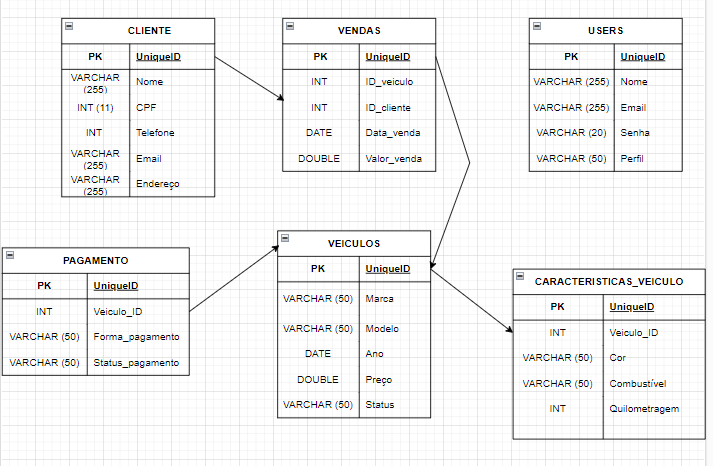

<h1 align="center"> PROJETO BACK END - DIGITAL COLLEGE </h1>

Projeto exclusivo da digital college promovido pelo programa geração tech. Que tem o objetivo de testar os conhecimentos sobre back-end.

  <a href="#-tecnologias">Tecnologias</a>&nbsp;&nbsp;&nbsp;|&nbsp;&nbsp;&nbsp;
  <a href="#-projeto">Projeto</a>&nbsp;&nbsp;&nbsp;|&nbsp;&nbsp;&nbsp;
  <a href="#-layout">Layout</a>&nbsp;&nbsp;&nbsp;

 

## 🚀 Tecnologias

Esse projeto foi desenvolvido com as seguintes tecnologias/Ferramentas:

- JavaScript
- Git e GitHub
- Express
- Dontenv
- Nodemon
- Jsonwebtoken
- Crypto
- Pg

## 💻 Projeto
 
Nosso projeto de Back-end é uma API que funciona como vendas de veículos, foi pensado para facilitar a vida de empresários, donos de lojas de automóveis, pois adaptamos o GRUD em todo nosso sistema. O próprio vendedor poderá adicionar produtos, editar, excluir e vender conforme informações alimentadas na tabela.

 

## 🔖 Layout

Você pode visualizar como ficou nosso banco de dados logo abaixo nas imagens. Criamos um diagrama relacional para facilitar a visualiação na hora de criar o banco de dados no pgAdmin4. Após isso, iniciamos nossa API.
 

  
   

